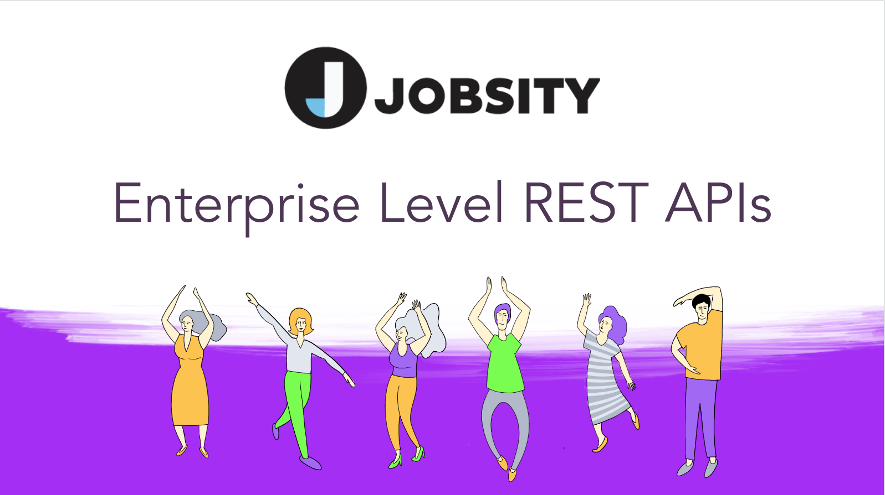
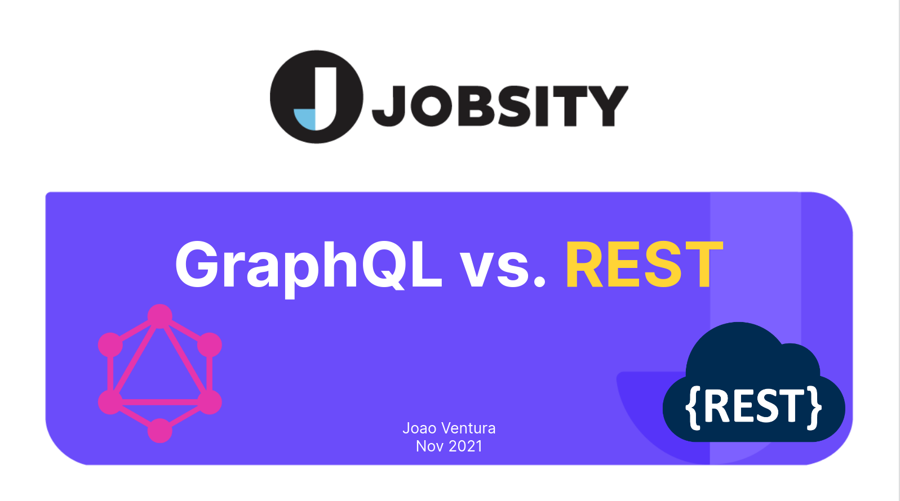
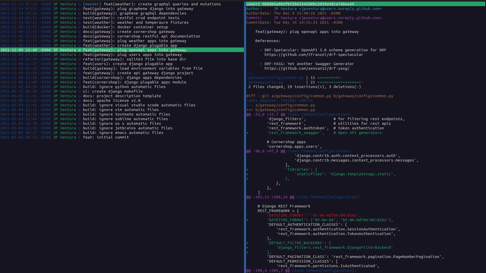

# Cornershop Weather API

[](https://github.com/agconti/cookiecutter-django-rest)

| **YouTube: Enterprise Level APIs** | **YouTube: RESTful APIs vs GrapQL** |
|------|----------|
| [](https://www.youtube.com/watch?v=XkOR2eHiD1s) | [](https://www.youtube.com/watch?v=XkOR2eHiD1s) |


The motivation is present a more elegant solution to refactoring monolithic (or several microservices) RESTful APIs using GraphQL as a facade.

The application is already deployed on [Google Appengine](https://weather-app-7019.uc.r.appspot.com/) with two graphical interfaces:

  - [GraphQL](https://weather-app-7019.uc.r.appspot.com/graphiql)
  - [Open API 3.0](https://weather-app-7019.uc.r.appspot.com/docs/)

# Architecture

The project was created using [Cookiecutter CLI][cookiecutter-url] and [Django RESTful Framework][cookiecutter-drf-url] and is structured as follows:

    cornershop
    ├── .env                     # Environment variables
    ├── cornershop               # Django reusable apps
    │   └── apps
    │       └── ...
    ├── gateway                  # Django project directory
    │   ├── config
    │   │   ├── common.py        # All environment common configuration
    │   │   ├── local.py         # Local only environment configuration
    │   │   └── production.py    # Production only environment configuration
    │   ├── urls.py              # API Gateway routes
    │   └── wsgi.py
    ├── deploy                   # Docker, Kubernetes, GCP, etc.
    └── manage.py

The motivations is create [Django reusable apps][django-apps-url] that are pluged into the `gateway` project, allowing the engineers to:

  - [Split the submodules into new repositories][github-split-url] when the engineering team becomes larger.
  - Work [git submodules][github-submodules-url] and choose the installed apps by semantic version.
  - Re-scale only choosed apps instead the whole monolith, since they may be pluged into separated instances.

Thus the `gateway` project is literaly a _gateway_ (or facade), that just join multiple apps.

# GraphQL

If you are not familiar with GraphQL, just open the [graphical interface](https://weather-app-7019.uc.r.appspot.com/graphiql) and start typing.

For example:

```graphql
{
  weathers {
    edges {
      node {
        city,
        temperatures {
          value
        }
      }
    }
  }
}
```

# Code is the documentation



We use git exhaustively, not only as a code versioning system, **but also as for documentation** through [conventional commit messages][semantic-commit-url].

So feel free to use your favorit [Git toolkit][tig-url] to learn why things were done the way they are.

# Automatic code generation

For automatically creating all Spring Boot base structure, just use [Swagger Codegen CLI][swagger-codegen-url]:

```bash
swagger-codegen generate \
    -i https://cornershop.uber.com/api/v1/swagger.json \    # Open API specification (not deployed)
    -l spring \                                             # Backend Framework (Spring, Ktor, Quarkus, etc)
    -o /tmp/cornershop                                      # Output pathname
```

or to produce a client library artifact:

```bash
swagger-codegen generate \
    -i https://cornershop.uber.com/api/v1/swagger.json \    # Open API specification (not deployed)
    -l android \                                            # Client language (Android, iOS, React, etc)
    -o /tmp/cornershop                                      # Output pathname
```

[cookiecutter-url]: https://github.com/cookiecutter/cookiecutter
[cookiecutter-drf-url]: http://agconti.github.io/cookiecutter-django-rest/
[django-apps-url]: https://realpython.com/installable-django-app/
[github-split-url]: https://docs.github.com/en/get-started/using-git/splitting-a-subfolder-out-into-a-new-repository
[github-submodules-url]: https://github.blog/2016-02-01-working-with-submodules/
[semantic-commit-url]: https://github.com/angular/angular/blob/22b96b9/CONTRIBUTING.md#-commit-message-guidelines
[swagger-codegen-url]: https://github.com/swagger-api/swagger-codegen
[tig-url]: http://jonas.github.io/tig/
[youtube-rest-img]: https://i.ytimg.com/vi/XkOR2eHiD1s/maxresdefault.jpg?v=6086ecae
[youtube-rest-url]: https://i.ytimg.com/vi/XkOR2eHiD1s/maxresdefault.jpg?v=6086ecae
[youtube-graphql-url]: https://www.youtube.com/watch?v=pL9f_3nbze8
